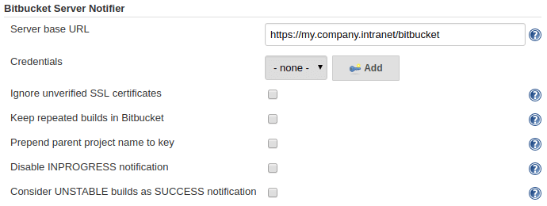

Bitbucket Server Notifier Plugin for Jenkins
============================================

This Jenkins plugin notifies Bitbucket Server (formerly known as Stash) of build results.
Failed or successful builds will show up as little icons in Bitbucket's web interface in
commit logs. Clicking on such an icon will take the user to the specific build.

Requirements
============

* **[Stash][] 2.1** or newer / **[Bitbucket Server][] 4.0** or newer
* **Jenkins 2.60.3** or newer

This plugin uses the Atlassian Stash / Bitbucket Server [Build REST API][].

Setup
=====

Set up Bitbucket Server Notifier by navigating to `Manage Jenkins --> Configure System` and scrolling down to the **Bitbucket Server Notifier** section.
Enter at least your `Server base URL` and `Credentials`.
Additional options are available as required.



### Script setup

Either automatically upon [Jenkins post-initialization][] or through [Jenkins Script Console][], example:

```groovy
Jenkins
    .instance
    .getDescriptor('org.jenkinsci.plugins.stashNotifier.StashNotifier')
    .with{
        credentialsId = 'bitbucket-creds'
        stashRootUrl = 'https://my.company.intranet/bitbucket'
        ignoreUnverifiedSsl = true
        disableInprogressNotification = true
        includeBuildNumberInKey = false
        prependParentProjectKey = false
        considerUnstableAsSuccess = false
    }
```

Usage
=====

Use the Bitbucket Server Notifier by adding it as a _Post Step_ in your Jenkins build job configuration.

1. In your Jenkins job configuration go to the *Post-build Actions* section, click on *Add post-build action* and select *Notify Bitbucket Instance*.
2. Enter the `Server base URL`, e. g. <tt>http://localhost:7990</tt> or <tt>https://my.company.intranet/bitbucket</tt>.<br>
If in doubt, go to your local Bitbucket server and check the URL in the browser.
The URL <tt>http://georg@localhost:7991/projects</tt> e. g. reveals the server base URL, which is <tt>http://localhost:7991</tt> in this case.
3. Select the `Credentials` for authenticating with Bitbucket.<br>
Please note that SSH credentials (public/private key) from Jenkins that might be added to Bitbucket are **not** used for the authentication.
Typically, in order to access Bitbucket you would add a service account (username and password) to Jenkins.

That's it. If you have configured everything correctly, Jenkins will notify
your Bitbucket instance of subsequent builds. The result is illustrated on
the Atlassian [Bitbucket Build Integration][] wiki page.

### Note on Pipeline Plugin usage

See the following code for an example of how to use this plugin inside of a
[Pipeline](https://jenkins.io/solutions/pipeline/). You must set the result of the
current build manually in the Pipeline script.

```groovy
node {
    checkout scm                            // Necessary so we know the current commit

    notifyBitbucket()                       // Notifies the Bitbucket instance of an INPROGRESS build

    try {
        // Do stuff

        currentBuild.result = 'SUCCESS'     // Set result of currentBuild !Important!
    } catch(err) {
        currentBuild.result = 'FAILED'      // Set result of currentBuild !Important!
    }

    notifyBitbucket()                       // Notifies the Bitbucket instance of the build result
}
```

Or you could as well use

```groovy
    checkout scm
    
    notifyBitbucket(buildState: 'INPROGRESS')        // Notifies the Bitbucket instance of an INPROGRESS build
    
    try {
        // Do stuff
        notifyBitbucket(buildState: 'SUCCESSFUL')    // Notifies the Bitbucket instance of an SUCCESSFUL build
    } catch(err) {
        // Do clean up
        notifyBitbucket(buildState: 'FAILED')        // Notifies the Bitbucket instance of an FAILED build
    }
```

In situations where an advanced setup is required the following can be used:

```groovy
node {
    this.notifyBitbucket('INPROGRESS')     // Notifies the Bitbucket instance of an INPROGRESS build

    try {
        // Do stuff

        this.notifyBitbucket('SUCCESS')
    } catch(err) {
        this.notifyBitbucket('FAILED')
    }
}

def notifyBitbucket(String state) {
    notifyBitbucket(
            commitSha1: 'commit',
            credentialsId: '00000000-1111-2222-3333-123456789abc',
            disableInprogressNotification: false,
            considerUnstableAsSuccess: true,
            ignoreUnverifiedSSLPeer: true,
            buildState: state,
            buildName: 'Performance Testing',
            includeBuildNumberInKey: false,
            prependParentProjectKey: false,
            projectKey: '',
            stashServerBaseUrl: 'https://my.company.intranet/bitbucket')

}
```

In [Declarative Pipelines](https://jenkins.io/doc/book/pipeline/syntax/#declarative-pipeline), where Jenkins sets `currentBuild.result = null` for `SUCCESS` builds, the current value can be modified via a `script` step, e.g.:

```groovy
pipeline {
    agent any
    stages {
        stage('Build') {
            steps {
                echo 'Hello World'
                // currentBuild.result == null here
            }
        }
    }
    post {
        always {
            script {
                currentBuild.result = currentBuild.result ?: 'SUCCESS'
                notifyBitbucket()
            }
        }
    }
}
```

### Note on credentials

Currently Bitbucket Server Build Notifier accepts only raw plaintext credentials as it uses the HTTP REST API of Bitbucket.

Maintainers
===========

* Georg Gruetter ([Twitter](https://twitter.com/bumbleGee), [GitHub](https://github.com/gruetter))
* Pavel Batanov ([GitHub](https://github.com/scaytrase))

License
=======

[Apache 2.0 License](http://www.apache.org/licenses/LICENSE-2.0.html)

[Stash]: https://confluence.atlassian.com/bitbucketserver/older-releases-776640690.html
[Bitbucket Server]: https://confluence.atlassian.com/bitbucketserver/bitbucket-server-release-notes-872139866.html
[Bitbucket Build Integration]: https://developer.atlassian.com/server/bitbucket/how-tos/updating-build-status-for-commits/
[Build REST API]: https://docs.atlassian.com/DAC/rest/stash/2.1.0/stash-build-integration-rest.html
[Jenkins post-initialization]: https://wiki.jenkins.io/display/JENKINS/Post-initialization+script
[Jenkins Script Console]: https://wiki.jenkins.io/display/JENKINS/Jenkins+Script+Console
